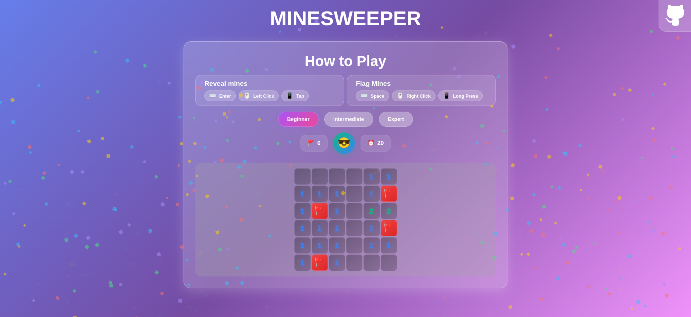
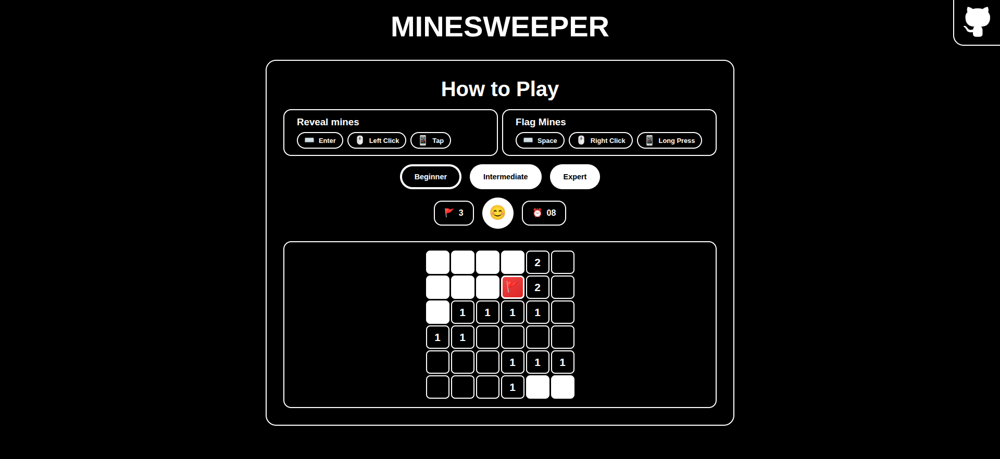

# 🧨 Minesweeper


A modern take on the classic Minesweeper game - accessible and responsive

## [DEMO](https://vladshlianin.github.io/minesweeper/)



## Features
- **Lightweight**  
  Whole game script in 5.0KB (and separate 1.4KB chunk for glorious confetti)

- **Full Keyboard Accessibility**  
  Is playable without a mouse

- **High Contrast Mode**  
  Respects user accessibility preferences for high contrast
  

- **First Click is Always Safe**  
  The first click is guaranteed to be mine-free.
---

No frameworks – just modern TypeScript and DOM APIs.

---

## Running Locally

Clone the repository and install dependencies:

```bash
npm install
```

To create an optimized production build and preview it locally:

```bash
npm run build
npm run preview
```